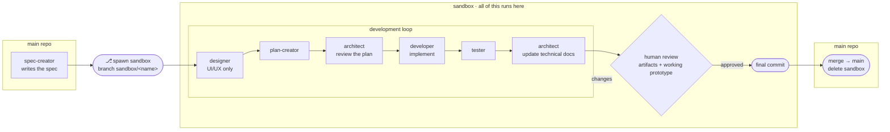

# specialist-agents

A Claude Code plugin that drops a spec-driven workflow into any new (or existing) project. Inflates six specialist agents, an architecture doc, a design folder, and a specs / roadmap / status set — all wired together by a generated `CLAUDE.md`.

**What this is — and isn't.** Unlike always-on skill layers you wear over every project, `specialist-agents` is a *one-shot inflation*: a fixed roster of sharp, single-responsibility agents dropped into one repo and tuned for your team. The agents live in the project's `agents/` folder. You invoke a specialist when a task calls for it — you don't run them all the time.

Reference implementation: [`lived-app`](https://github.com/srix/lived-app) — the project this scaffold was extracted from.

## What you get

Run `/specialist-agents:setup` inside a project directory and the following lands in `cwd`:

```
.
├── CLAUDE.md                ← project guide for Claude Code, points at agents/ + architecture/
├── agents/
│   ├── spec-creator.md      ← writes specs/<task>-spec.md (the WHAT)
│   ├── designer.md          ← UX/UI thinking for user-facing specs (the LOOK & FEEL)
│   ├── plan-creator.md      ← writes specs/<task>-plan.md (the HOW)
│   ├── architect.md         ← owns architecture/architecture.md; reviews plans, updates post-merge
│   ├── developer.md         ← implements an approved plan on the sandbox branch
│   └── tester.md            ← authors / runs / audits tests 1:1 against acceptance criteria
├── architecture/
│   ├── architecture.md      ← living technical doc with ADR-style decision log
│   └── local-development.md ← setup notes, commands, gotchas
├── design/
│   ├── README.md            ← where things live; engineer-facing
│   ├── design-system.md     ← tokens, type, spacing, motion, components, decisions
│   ├── mockups/             ← self-contained HTML mockups from the designer agent
│   └── exports/             ← dated snapshots from an external design tool (optional)
├── sdlc/
│   └── flow.md              ← SDLC flow — Mermaid diagram + sandbox lifecycle
└── specs/
    ├── REQUIREMENTS.md      ← product-level FRs / NFRs
    ├── ROADMAP.md           ← phased plan with entry/exit criteria
    ├── STATUS.md            ← live phase + task-spec inventory
    └── ui-design-brief.md   ← product-level UI brief
```

## The workflow

The spec is authored in `main`; everything else — build, your review, and the final commit — happens inside a sandbox, reviewed once just before that commit. Only the merge crosses back to `main`. Scaffolded projects get this as [`sdlc/flow.md`](templates/sdlc/flow.md.tmpl).



Each agent has a sharp role:

- **spec-creator** writes the WHAT/WHY in user-observable terms; no implementation talk.
- **designer** (UI/UX tasks only) turns the spec into surfaces, flows, interaction states, and design-system decisions — producing `specs/<task>-design.md` and self-contained HTML mockups under `design/mockups/`. No code.
- **plan-creator** answers HOW: file-level changes, reusable code to leverage, verification steps.
- **architect** gates plans against `architecture.md` and updates the doc after merges.
- **developer** executes the plan on the sandbox branch (no worktree gymnastics), reports back with a branch.
- **tester** maps every acceptance criterion to a test (or a manual-deferred procedure), and runs the full audit on demand.

## Composes with your skills

The agents define the **roles**; they're built to lean on community **skills** for technique. Each agent file has a *Leverage available skills* section nudging it toward the relevant packs when they're installed — and the agents stay fully functional without any:

- **`superpowers`** — brainstorming, writing-plans, TDD, systematic-debugging, verification-before-completion, code review (used across every agent).
- **`frontend-design`** — distinctive, production-grade UI (designer).
- **Code-craft packs** like **`impeccable`** and **`mattpocock`** — language idioms and quality, especially TypeScript (plan-creator, developer).

This is deliberately *additive*: `specialist-agents` orchestrates who does what; these skills sharpen how each one works.

## Why a plugin (not just a skill)?

A **skill** is one self-contained capability — a `SKILL.md` plus bundled files. It's simple and portable (even cross-agent via the [`skills`](https://www.skills.sh) CLI), but it's a *single* thing.

A **plugin** is a versioned package that bundles *multiple* component types — skills **plus** subagents, slash commands, hooks, and MCP servers — installed via `/plugin` from a marketplace.

specialist-agents is a plugin because it ships more than one thing:

- **6 dispatchable subagents** (`agents/`) — only a plugin registers these as agent types you can invoke (`specialist-agents:architect`, …).
- **the `setup` skill** (`/specialist-agents:setup`) — the one-time inflate action.
- **templates** for the scaffolded files, plus a **versioned marketplace** so a team can pin and upgrade.

A bare skill couldn't register the subagents or give you the marketplace/versioning. (The `setup` skill is the one piece that *could* also be published standalone via the `skills` CLI if cross-agent reach is ever wanted.)

## Install (local, for yourself)

The repo doubles as its own marketplace (`.claude-plugin/marketplace.json`), so installation is two commands:

```bash
/plugin marketplace add /media/workdir/workspace/srix-scaffold
/plugin install specialist-agents@specialist-agents
```

The first command registers the repo folder as a marketplace; the second installs the plugin from it. The `@specialist-agents` suffix names the marketplace (set in `marketplace.json`), and the plugin is also called `specialist-agents` — hence the doubled name. (The repo folder itself is still `srix-scaffold`; that's just where the files live.)

Then in any project:

```bash
/specialist-agents:setup
```

The skill prompts for project name, stack, build commands, then inflates the templates into `cwd`. It refuses to overwrite existing files by default.

## Install (for colleagues, from GitHub)

Once published:

```bash
/plugin marketplace add srix/specialist-agents
/plugin install specialist-agents@specialist-agents
```

Tag stable versions so colleagues can pin (`v0.1.0`, `v0.2.0`) while you keep iterating on `main`.

## Maintenance — the harvest loop

You'll notice improvements while *using* the agents in a real project — that's where friction surfaces. The discipline:

1. Fix it in the real project first.
2. Once the change has been used a few days, port the diff into this plugin repo.
3. Bump the version (`plugin.json`), write a one-line `CHANGELOG.md` entry.
4. Tag.

Don't edit the plugin from inside a real project's directory — it muddles the source of truth. Open the `srix-scaffold/` repo in its own editor window for plugin work.

The opposite direction (plugin → real project) is harder: existing projects don't auto-upgrade. Treat the scaffold as a one-shot inflation, not a runtime dependency. When you want new patterns in an old project, manually port what you want from the plugin.

## Versioning

Semver, loosely:
- **Patch** — content tweaks inside an existing file (wording, examples).
- **Minor** — new agent, new template file, new skill, new placeholder.
- **Major** — folder shape change, breaking placeholder rename, removed agent.

Existing inflated projects only see plugin upgrades if the user re-runs `/specialist-agents:setup` — and even then only for new files (existing files are skipped by collision policy).

## Files

- `.claude-plugin/plugin.json` — plugin metadata.
- `skills/setup/SKILL.md` — the `/specialist-agents:setup` skill.
- `agents/*.md` — copied verbatim into the user's project (with `{{PROJECT_NAME}}` / `{{VERIFY_COMMAND}}` substituted).
- `templates/**/*.tmpl` — inflated with placeholder substitution; `.tmpl` suffix stripped on copy.
- `CHANGELOG.md` — one line per release.
```
